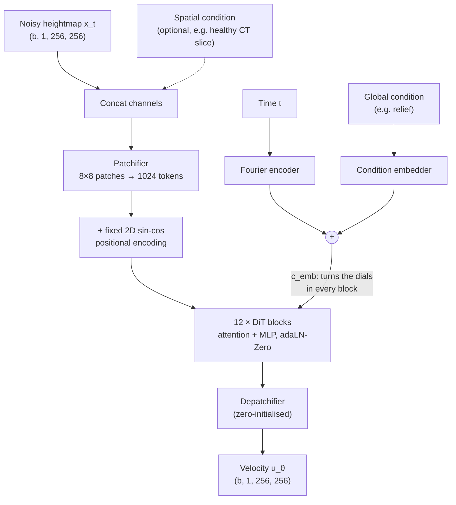

# GameDiT 🎮⛰️

**Game-world terrain generation with a Scalable Interpolant Transformer (SiT), made playable in Unreal Engine 5.**

*GameDiT.* A diffusion transformer learns what real mountains look like from satellite elevation data, dreams up new ones, and Unreal Engine turns them into worlds you can walk around in.

---

## The idea in one picture


Think of it as a pipeline where **the model is the architect and Unreal is the construction crew.** The model draws the blueprint (a heightmap: an image where brightness means altitude). UE5 builds the terrain from it, paints it with materials, scatters trees and rocks, and drops a player in.

---

## Why a diffusion *transformer*, and why *flow matching*?

Two separate choices are easy to mix up:

| Choice | What it decides | GameDiT uses |
|---|---|---|
| **Training recipe** | How noise is turned into data | **Flow matching** (linear interpolant, velocity prediction) |
| **Backbone** | The network that runs the recipe | **Diffusion Transformer** (patches + adaLN-Zero) |

DiT paired with flow matching is exactly what [SiT (Ma et al., 2024)](https://arxiv.org/abs/2401.08740) studied. SiT keeps DiT's architecture unchanged and swaps the DDPM objective for a stochastic interpolant, which gives better sample quality with the same backbone.

**How flow matching works, briefly.** Picture every real terrain connected to a random noise image by a straight line. The model learns the *direction of travel* at every point along those lines. To generate a terrain, start at fresh noise and follow the arrows until you arrive at a mountain range that never existed.

```
x_t = t · z + (1 − t) · ε        t = 0 → noise,  t = 1 → data
target velocity  u = z − ε
loss = ‖ u_θ(x_t, t, cond) − (z − ε) ‖²
```

> ⚠️ **Time convention:** this repo follows the MIT 6.S184 notes (t = 0 is noise, t = 1 is data). The official SiT codebase uses the **opposite** convention.

---

## Architecture



The model follows the DiT/SiT design, written from scratch in the style of the MIT 6.S184 lab, with three deliberate tweaks:

1. **Fixed sin-cos positional encodings.** They have no parameters and work at any image size, including non-square images.
2. **A pluggable condition embedder.** Continuous values, class labels and whole images can all steer the model. Each condition has its own learned "null" for classifier-free guidance.
3. **A zero-initialised output layer.** A fresh model predicts zero velocity, which gives a calm, stable start to training.

**Default size:** SiT-S/8, which has 12 layers, a hidden size of 384 and 6 heads, for about 30M parameters.

---


## Repository layout

```
GameDiT/
├── paths.py        # distributions + Gaussian probability paths (linear & cosine)
├── simulators.py   # model interface, ODE/SDE, Euler / Heun / Euler–Maruyama, CFG
├── model.py        # SiT backbone: patchifier, DiT blocks, condition embedders
├── train.py        # Trainer / CFGTrainer, EMA, bf16, checkpoint + resume, sample grids
├── data.py         # project-specific: DEM download, crops, hillshade visualisation
└── configs/
    └── gamedit.yaml   # model / training / sampling settings
```

Every core file has a built-in self-test that checks its behaviour against known answers:

```bash
python paths.py        # endpoints, vector-field identities, schedule derivatives
python simulators.py   # samplers reach an analytically known target; batched CFG is exact
python model.py        # shapes, zero-init, conditioning, dropping, gradients, sampling
python train.py --selftest   # tiny CPU run: loss drops, checkpoints written, resume works
```

---

## Quick start

```bash
pip install torch einops tqdm matplotlib pyyaml

# Sanity-check everything (CPU is fine)
python paths.py && python simulators.py && python model.py && python train.py --selftest

# Train (once data.py and the config are in place)
python train.py --config configs/gamedit.yaml
```

A run writes to `runs/<run_name>/`:

```
runs/<run_name>/
├── checkpoints/   # step_XXXXXXX.pt (last 3 kept) + latest.pt
├── samples/       # real.png + a sample grid at every checkpoint
└── loss.csv       # step, loss, lr, grad_norm
```

If a run is interrupted, re-running the same command **resumes automatically** from `latest.pt`. Set `s3_uri` in the config to mirror the run folder to S3 in the background.

**What the training loop includes:**

- **EMA weights (0.9999).** All samples come from the averaged model, which is far sharper than the raw weights.
- **bf16 autocast and gradient clipping.** These give speed and stability on A100-class GPUs.
- **Classifier-free guidance.** Conditions are dropped 10% of the time during training, and the guided and unguided passes are batched together at sampling time.
- **Heun sampler by default.** It is second order, so it gives good quality in about 50 steps.

---

## Data

GameDiT trains on **real Earth terrain** from the [Copernicus DEM GLO-30](https://registry.opendata.aws/copernicus-dem/). This is free global elevation data at 30 m resolution, openly available on AWS. Tiles come from dramatic mountain regions (the Alps, Rockies, Himalaya, Andes, Iceland, the Scottish Highlands and New Zealand's Southern Alps) so the generated worlds look like game landscapes rather than farmland.

**Planned pipeline:**

1. Download about 200 one-degree tiles directly to cloud storage.
2. Resample to about 60 m, so each crop contains more interesting features.
3. Crop to 256 × 256 and discard flat, ocean or missing-data crops.
4. Normalise each crop to [−1, 1] and keep its original height range as the **relief** condition.
5. Augment with flips and 90° rotations, which gives 8× the data for free.
6. Store everything as one float16 file (about 5 GB) and split train/validation **by region**, to avoid leakage from overlapping crops.

Heightmaps are displayed as **hillshades**, meaning shaded relief lit from one side. Raw heightmaps look like grey fog; hillshades look like terrain.

---

## Compute

| | |
|---|---|
| Model | SiT-S/8, about 30M parameters, 1,024 tokens per image |
| Data | about 40k crops of 256 × 256 (about 5 GB) |
| Training | about 50–100k steps, estimated at 3–6 hours on one A100 |
| Platform | [Lightning AI](https://lightning.ai) Studios (training), AWS EC2 GPU instance (Unreal Engine) |


---


## References

- Ma et al., *SiT: Exploring Flow and Diffusion-based Generative Models with Scalable Interpolant Transformers*, 2024. [arXiv:2401.08740](https://arxiv.org/abs/2401.08740)
- Peebles & Xie, *Scalable Diffusion Models with Transformers (DiT)*, 2023. [arXiv:2212.09748](https://arxiv.org/abs/2212.09748)
- Lipman et al., *Flow Matching for Generative Modeling*, 2023. [arXiv:2210.02747](https://arxiv.org/abs/2210.02747)
- MIT 6.S184, *Generative AI with Stochastic Differential Equations*. This codebase follows its lab structure and notation.
- [Copernicus DEM](https://spacedata.copernicus.eu/collections/copernicus-digital-elevation-model), produced using Copernicus WorldDEM™-30 © DLR e.V. 2010–2014 and © Airbus Defence and Space GmbH 2014–2018, provided under COPERNICUS by the European Union and ESA.

---

## Author

**Puneet Mishra**, MSc Data Science & AI (IIT Madras × University of Birmingham)