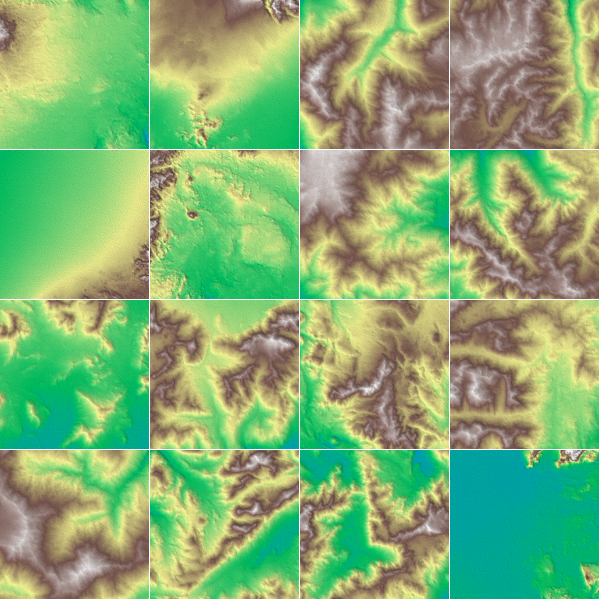
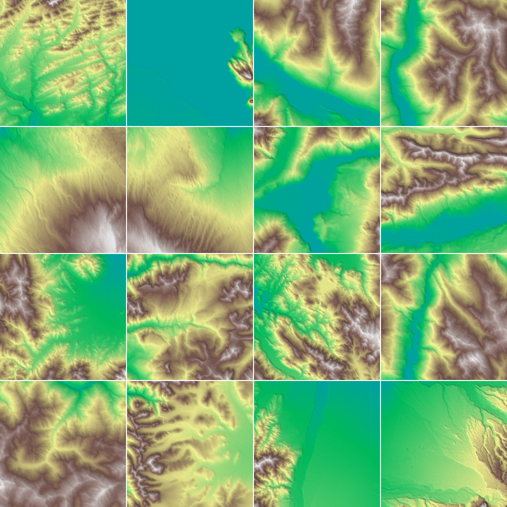
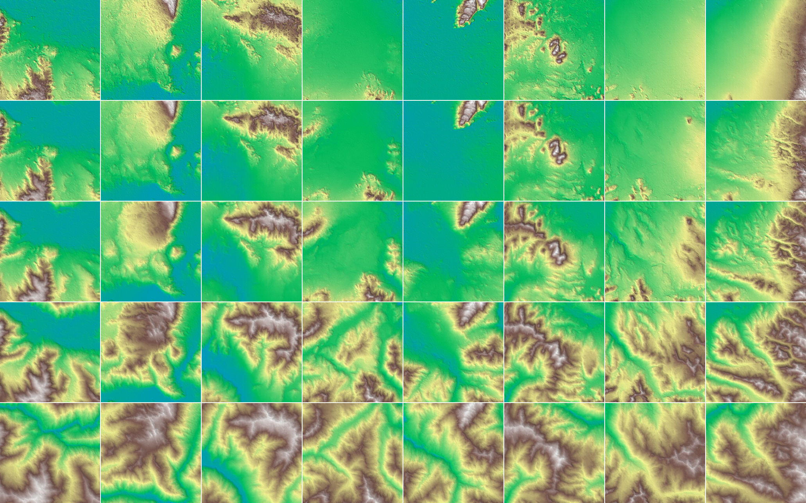
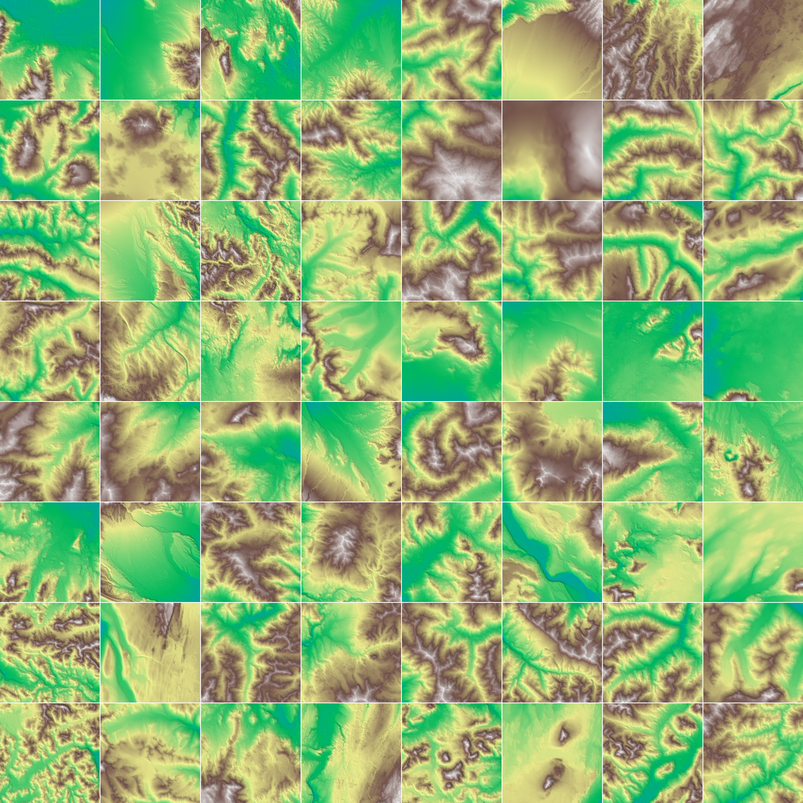
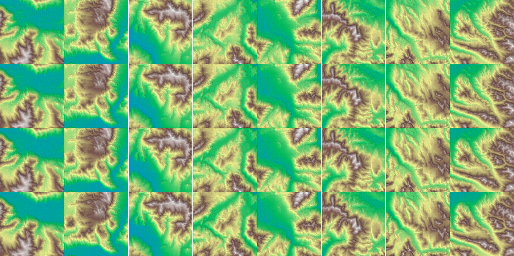
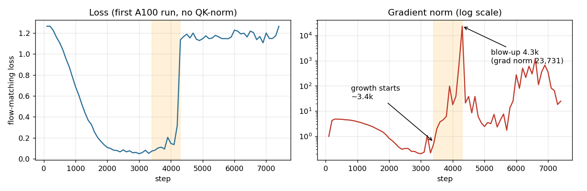

# GameDiT 🎮⛰️

**A diffusion transformer, trained from scratch on real Earth terrain, that generates new landscapes you can walk around in Unreal Engine 5.**

*Gamed-it.*

<!-- TODO (after UE5): replace with a GIF or screenshot of the walkable world, plus a link to the demo video -->
<p align="center"><i>🎬 UE5 walkthrough: coming soon</i></p>

<p align="center">
  
  &nbsp;
  
  <br/>
  <b>Left:</b> generated by GameDiT &nbsp;·&nbsp; <b>Right:</b> real Copernicus DEM crops
</p>

---

## How it works


```mermaid
flowchart LR
    A[🛰️ Real elevation data<br/>Copernicus DEM] --> B[✂️ 17k terrain crops<br/>256×256 @ 60 m]
    B --> C[🧠 SiT trained from scratch<br/>flow matching]
    C --> D[🎲 New heightmaps<br/>relief-conditioned]
    D --> E[🗺️ 16-bit PNG + scale JSON]
    E --> F[🎮 Unreal Engine 5<br/>Landscape + PCG]
    F --> G[🚶 Walkable world]
```

The model is the architect and Unreal is the construction crew. GameDiT draws the blueprint: a **heightmap**, an image where brightness means altitude. UE5 lifts a grid mesh to those heights, paints it with materials, scatters foliage and drops a player in.

- **Model:** a [SiT](https://arxiv.org/abs/2401.08740), meaning a Diffusion Transformer trained with **flow matching**. It learns the velocity that carries pure noise to realistic terrain along a straight path: `x_t = t·z + (1−t)·ε`, with target `z − ε`.
- **Conditioning:** one number, `y ∈ [0, 1]`, the crop's relief (height range) on a log scale from 150 m to 4,000 m. This acts as a ruggedness dial.
- **Everything is written from scratch in PyTorch:** the model, probability paths, samplers, training loop and data pipeline.

---

## Results

### Relief control

Same starting noise in every column; only the relief condition changes down the rows (`y` = 0.1, 0.3, 0.5, 0.7, 0.9).

<p align="center"></p>

The large-scale layout stays tied to the noise, so each column is recognisably the same place. Meanwhile `y` controls **how rugged** that place is: gentle lowland at the top, deeply dissected mountains at the bottom. Drainage networks, ridgelines and valley floors emerge with no explicit rule telling the model to create them.

### Memorisation check

A generative model can "succeed" by copying its training data. To test for this, every generated sample was compared with **all 17k training crops in all 8 orientations** (training used flips and rotations). The same was done for real crops the model never saw (the validation set), as a reference.

| | Median distance to nearest training crop (RMSE) |
|---|---|
| Generated samples (n = 32) | **0.299** |
| Real, unseen validation crops (n = 32) | 0.279 |
| **Ratio** | **1.07** |

A ratio of about 1 means generated terrain is as far from the training set as genuinely new real terrain. **The model invents landscapes rather than recalling them.** Even the single closest generated sample (RMSE 0.19) is far from a copy.

<p align="center"></p>

### Guidance and sampler steps

Rows show classifier-free guidance `w` = 1.0, 1.5, 2.0, 3.0. Columns use the same noise.

<p align="center"></p>

Guidance has only a subtle effect here. Higher `w` gives slightly crisper ridges and slightly grainier flats. That's expected, because the condition is a single scalar and most of the realism comes from the unconditional model. **`w = 2.0`** is the chosen balance. Sampling with 50 and 100 Heun steps gave visually identical results, so **50 steps** is used.

---

## Training details

| | |
|---|---|
| **Data** | 17,102 crops of 256 × 256 at 60 m/pixel (each about 15 km across) from 10 mountain regions: Alps, Colorado and Canadian Rockies, Himalaya, Karakoram, Central Andes, Patagonia, Iceland, Scottish Highlands, NZ Southern Alps. Train/val split **by tile**, to avoid leakage between overlapping crops. |
| **Preprocessing** | Resampled to square 60 m pixels; sea, flat and no-data crops filtered out; each crop normalised to [−1, 1], with its height range kept as the condition; random flips and rotations (8×) during training |
| **Model** | SiT-S/8: 12 layers, width 384, 6 heads, patch 8 (1,024 tokens), **33.5M parameters**. adaLN-Zero conditioning, fixed 2D sin-cos positions, **QK-norm** attention |
| **Objective** | Flow matching, linear interpolant, velocity prediction. Condition dropped 10% of the time for classifier-free guidance |
| **Optimisation** | AdamW, lr 1e-4 with 2k-step warm-up, batch 128, bf16, gradient clipping at 1.0, EMA with warm-up (samples drawn from EMA weights) |
| **Compute** | One NVIDIA A100 on Lightning AI. **45k steps, about 7 GPU-hours** (about 1.8 steps/s) |
| **Sampling** | Heun ODE solver, 50 steps, CFG `w = 2.0` |

---

## Debugging a training collapse

The first A100 run trained well, then collapsed:

<p align="center"></p>

1. **Healthy phase (to about 3.1k steps):** the loss fell from 1.29 to about 0.06, and gradient norms settled at about 0.25.
2. **Early warning (3.4k–3.8k):** gradient norms began climbing (0.5 → 6) **while the loss still looked fine**.
3. **Blow-up (4.3k):** the gradient norm hit **23,731**, and the loss jumped back to about 1.2, the value of an untrained model. It never recovered.

**Diagnosis: attention-logit growth.** Query and key vectors gradually grow during training, so attention scores `q·k` grow with them. The softmax saturates, gradients through it explode, and the weights are destroyed. Gradient clipping doesn't prevent this under Adam.

**Fix: QK-norm.** Queries and keys are RMS-normalised per head before the dot product, which bounds every attention score: `|q·k| / √d ≤ √d`. The same technique is used in Stable Diffusion 3 and large vision transformers. The attention layer was rewritten with `F.scaled_dot_product_attention`, so it still uses the fused flash kernel. **The fixed run trained stably to 45k steps.**

Two other lessons from this run: watch the `grad_norm` column, not just the loss, because it warned about 1,000 steps earlier. And checkpoint often enough that a healthy checkpoint exists before a failure.

<!-- TODO: overlay the loss curve of the fixed run for comparison -->

---

## From heightmap to playable world (UE5)

<!-- TODO: screenshots of each stage -->

1. **Export:** `sample.py export` writes each terrain as a **16-bit grayscale PNG** at 1009 × 1009 (8-bit would cause visible terracing), plus a JSON with its real height range and the matching UE5 scale values:

   ```json
   { "height_range_m": 1480.2, "metres_per_pixel": 15.24,
     "ue_scale_xy": 1524.0, "ue_scale_z": 289.1 }
   ```

   (Illustrative values. Each file gets its own.)
2. **Landscape import:** UE5 Landscape mode → Import from file, with X/Y scale `ue_scale_xy` and Z scale `ue_scale_z`. These follow from UE units being centimetres, and a Z scale of 100 spanning 512 m.
3. **Auto-material:** rock on steep slopes, grass on flats, snow at altitude, driven by slope and height.
4. **PCG foliage:** trees in valleys, rocks on slopes, nothing on cliffs.
5. **Playable:** Third Person template, sky and lighting, water plane.

---

## Repository layout

```
GameDiT/
├── configs/
│   ├── gamedit.yaml          # full A100 run
│   └── gamedit_dryrun.yaml   # 2k-step sanity run
├── src/
│   ├── paths.py        # Gaussian probability paths (linear & cosine interpolants)
│   ├── simulators.py   # model interface, Euler / Heun samplers, batched classifier-free guidance
│   ├── model.py        # SiT backbone: patchifier, QK-norm attention, adaLN-Zero blocks, condition embedders
│   ├── train.py        # Trainer / CFGTrainer, EMA, bf16, checkpoint + auto-resume, sample grids
│   ├── data.py         # Copernicus DEM download, crop pipeline, GPU-resident sampler, hillshade rendering
│   └── sample.py       # guidance / relief sweeps, nearest-neighbour check, 16-bit export for UE5
└── docs/assets/        # figures used in this README
```

The backbone is data-agnostic. Conditions can be scalars (like relief), class labels, or whole images concatenated as extra input channels, so the same code can be reused for other image-generation problems by changing only the data module and config.

Each core file has a built-in self-test:

```bash
cd src
python paths.py && python simulators.py && python model.py && python train.py --selftest && python data.py selftest
```

---

## Reproduce

```bash
pip install -r requirements.txt     # torch>=2.4, einops, tqdm, matplotlib, pyyaml, rasterio
cd src

# 1. Data (CPU, ~30-60 min): download about 180 DEM tiles -> crops -> preview grid
python data.py all

# 2. Train (GPU; auto-resumes from runs/<run_name>/checkpoints/latest.pt)
python train.py --config ../configs/gamedit.yaml

# 3. Sample
python sample.py grid   --ckpt runs/<run_name>/checkpoints/latest.pt                # guidance x steps comparison
python sample.py relief --ckpt runs/<run_name>/checkpoints/latest.pt --w 2.0
python sample.py nn     --ckpt runs/<run_name>/checkpoints/latest.pt --n 32         # memorisation check
python sample.py export --ckpt runs/<run_name>/checkpoints/latest.pt \
       --y 0.7 --w 2.0 --steps 50 --smooth 1.0 --n 16 --seed 16 --size 1009
```

For export, `y` sets the character of the terrain: about **0.5** for rolling hills and valleys, **0.7** for rugged mountains, **0.9** for dramatic alpine terrain.

---

## Limitations

- **Heightmaps store one height per point,** so there are no caves, arches or overhangs. This is standard for game terrain, but it is a real constraint.
- **Tiles are independent.** Two generated tiles placed side by side don't match at the edges.
- **Resolution:** 256 px at 60 m. Fine detail comes from upscaling and UE5 materials, not from the model.
- **Low-relief samples are grainy:** at `y ≤ 0.3`, flat areas show fine speckle. The `--smooth` export option mostly removes it.
- **The data is a surface model (DSM),** so forest canopy and buildings show up as slight texture in the training data.

## Future work

- **Outpainting** for large seamless worlds: generate each new tile conditioned on its neighbours' edges.
- **Higher resolution:** larger crops or a two-stage upsampler.
- **In-engine generation:** export the model to ONNX and run it inside Unreal with the Neural Network Engine (NNE), for "press a key, get a new world" with no Python involved.
- **Richer conditioning:** climate, erosion style or a rough user sketch, in addition to relief.
<!-- 
## Roadmap

- [x] Probability paths, samplers, batched classifier-free guidance
- [x] SiT backbone with pluggable conditioning and QK-norm
- [x] Training loop with EMA, bf16, checkpoint + auto-resume
- [x] Copernicus DEM data pipeline and hillshade visualisation
- [x] Full training run (45k steps, A100)
- [x] Evaluation: relief control, guidance comparison, memorisation check
- [x] 16-bit heightmap export with UE5 scale metadata
- [ ] UE5: Landscape import, auto-material, PCG foliage, playable character
- [ ] Demo video
- [ ] "Generate new world" script: sample → export → import → play
- [ ] Stretch: outpainting, in-engine generation via ONNX + NNE

--- -->

## References

- Ma et al., *SiT: Exploring Flow and Diffusion-based Generative Models with Scalable Interpolant Transformers*, 2024. [arXiv:2401.08740](https://arxiv.org/abs/2401.08740)
- Peebles & Xie, *Scalable Diffusion Models with Transformers (DiT)*, 2023. [arXiv:2212.09748](https://arxiv.org/abs/2212.09748)
- Lipman et al., *Flow Matching for Generative Modeling*, 2023. [arXiv:2210.02747](https://arxiv.org/abs/2210.02747)
- Esser et al., *Scaling Rectified Flow Transformers for High-Resolution Image Synthesis (Stable Diffusion 3)*, 2024. [arXiv:2403.03206](https://arxiv.org/abs/2403.03206)
- Dehghani et al., *Scaling Vision Transformers to 22 Billion Parameters*, 2023 (QK-norm for training stability). [arXiv:2302.05442](https://arxiv.org/abs/2302.05442)
- MIT 6.S184, *Generative AI with Stochastic Differential Equations*. This codebase follows its lab structure and notation.
- [Copernicus DEM GLO-30](https://registry.opendata.aws/copernicus-dem/). Check the [licence](https://spacedata.copernicus.eu/collections/copernicus-digital-elevation-model) for the exact attribution wording required.

---

**Puneet Mishra**, MSc Data Science & AI (IIT Madras × University of Birmingham) · [GitHub](https://github.com/mpuneet063) · [LinkedIn](https://www.linkedin.com/in/puneet-mishra-0827a231)